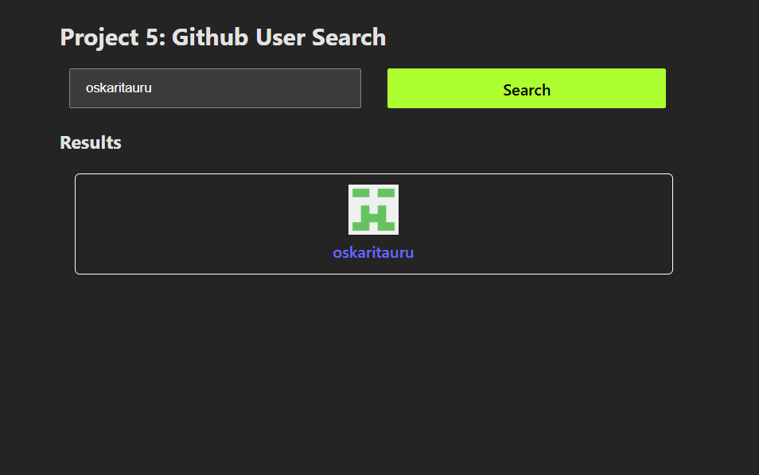

# Github User Search

This is a solution to the [Github User Search project on FreeCodeCamp](https://www.freecodecamp.org/news/react-projects-for-beginners-easy-ideas-with-code/).

### Built with

- Semantic HTML5 markup
- CSS custom properties
- React

### Screenshot

### What I learned

- HTML and CSS Skills
- React Usage
- Component-Based Development
- State and Props
- React Hooks, such as useState and useEffect
- State Management
- API Integration
- User Interface Design
- Debugging and Problem-Solving
- Code Organization
